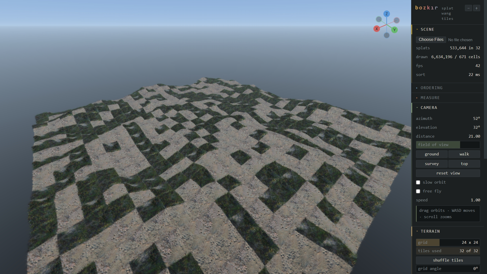
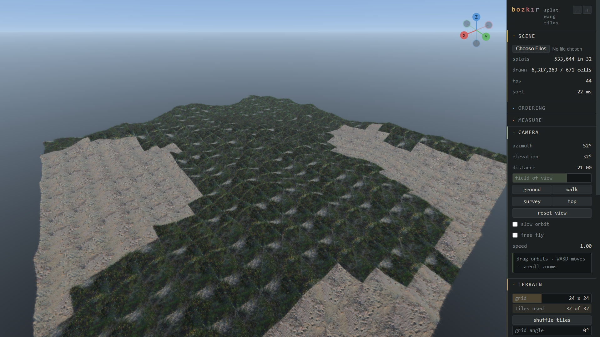
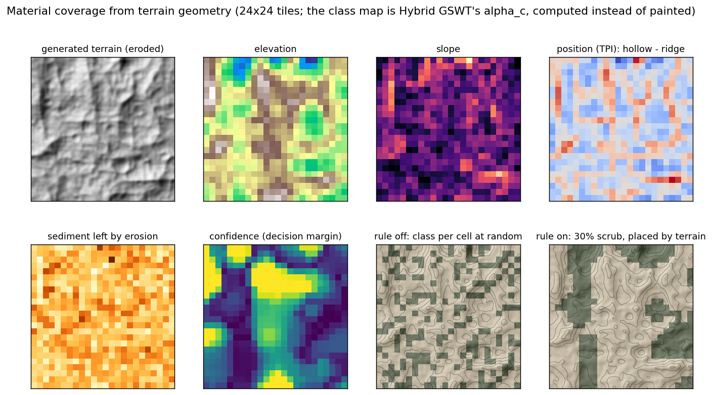
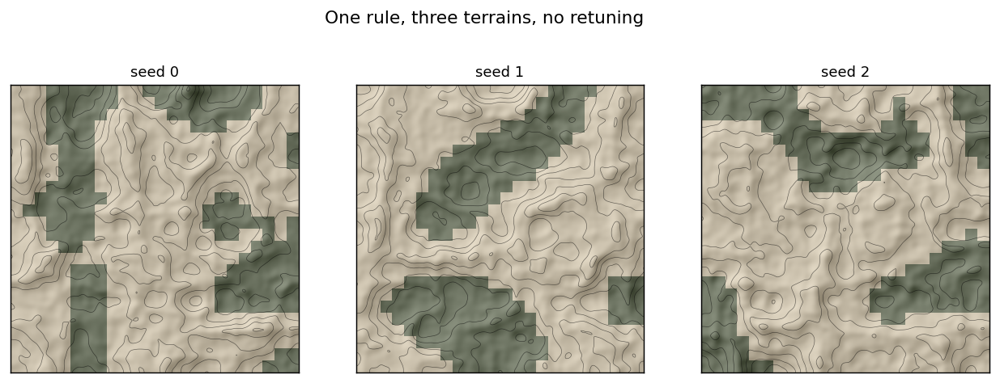
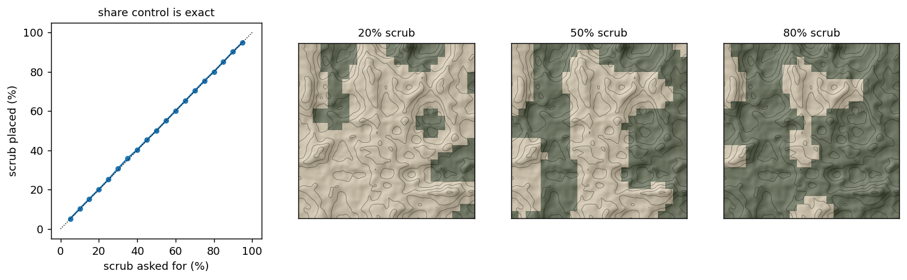
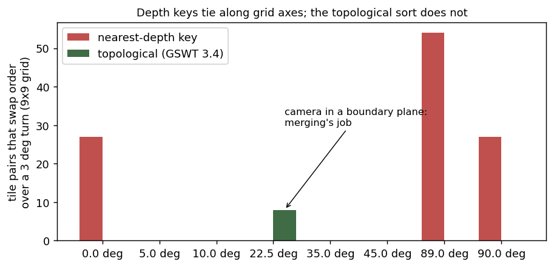

# bozkır

Procedural terrain from captured Gaussian splats, with material placed by
the shape of the ground.

A capture of a few square metres of ground is cut into square tiles whose
edges match and laid out as Wang tiles into terrain with no visible seam.
That part reimplements *Gaussian Splatting Wang Tiles* (Zeng, Ma and Sander,
SIGGRAPH Asia 2025). **What is new is where each material goes.**

| bigsur | desert |
|---|---|
|  |  |

| rule off | rule on |
|---|---|
|  |  |

Same tiles, same terrain, same 30% share. The only difference is whether
each cell's material is chosen at random or from the shape of the ground.

---

## The contribution: material coverage computed from terrain

*Hybrid Gaussian Wang Tiles* (SIGGRAPH 2026) picks a material class at each
world position with

```
P̃_c(x, u) = P_c(u) ^ (1 / α_c(x)),    c* = argmax_c P̃_c(x, u)
```

where α_c(x) is a target-coverage field per class — and in their authoring
tool **a person paints it**. Nobody paints a ten-kilometre map, and every
terrain shader in every engine already places material by slope and height.

bozkır computes α_c from the terrain instead: slope, topographic position
(TPI, Weiss 2001), drainage, altitude, and on generated terrain the
erosion's own sediment record. Their equation takes it unchanged.



The rule reads four maps sampled at 4× the tile grid (one sample per tile
aliases), max-pools drainage so a channel narrower than a tile survives,
passes the class-lead field through a **median filter** (edge-preserving,
so regions become contiguous without the boundary moving) and thresholds it
at a **quantile**, so the requested share is exact by construction.



The same rule with the same settings on three terrains: it is a rule, not a
placement. The share is an artist's control and the terrain decides where
that share goes:



**What this can and cannot claim.** Finding tiles, splitting a capture into
classes, the terrain analysis and the rule work for any input. The mapping
from landform to material — collected material in hollows, bare ground on
ridges — is a judgement: defensible for sand and gravel in arid ground,
wrong for moss on shaded rock. The claim is *a framework for geometry-driven
material placement*, and `scripts/validate_rule.py` tests the judgement
against a real survey (below). Learning the mapping from surveys is the
open question.

---

## Validating the rule on a real survey

`scripts/validate_rule.py` takes an OpenDroneMap DTM and orthophoto, lines
them up on the viewer's cell grid, runs the viewer's own rule on the DTM,
and scores its map against where scrub actually grows:

```bash
python scripts/validate_rule.py odm_dem/dtm.tif odm_orthophoto/odm_orthophoto.tif --dsm odm_dem/dsm.tif
```

Three things keep the number honest. The rule is given the true share, so
it is judged only on *where*. Chance is measured, not assumed: material is
clumped, and clumpy maps overlap by chance, so the truth is shifted around
a torus and scored at every offset. And the hypothesis — in arid ground
scrub grows where water collects — is stated before looking, with the
flipped mapping reported beside it. Truth comes from colour and,
independently, from vegetation height (DSM − DTM), since they fail in
different ways.

<!-- RESULT: paste the grid-24 table and docs/validation.png here once run. -->

---

## Running it

The renderer needs a static server, since ES modules will not load from
`file://`:

```bash
cd web && python -m http.server 8000
```

Then `http://localhost:8000/?scene=desert`. Drop a tileset zip on the page
to view another.

The constructor needs `numpy`, `plyfile` and `Pillow`:

```bash
python scripts/preview_patches.py data/raw/scene.ply --save-preset scene
python scripts/export_wang.py data/raw/scene.ply --preset scene --patches 0,2,4,5
python scripts/export_wang.py data/raw/desert.ply --preset desert2 --classes 2 --exclude 5,10,12,33,44
python scripts/terrain_gen.py --name desert --size 512 --ridge 0.6
```

`preview_patches` searches for candidate tiles and writes a sheet of
thumbnails; pick four and pass them to `export_wang`. `--classes 2` splits
a capture into two materials and refuses if it only holds one.
`terrain_gen` writes an eroded height field and its sediment map;
`heightmap.py` makes one from a drone DTM or from any PLY.

Figures and tests:

```bash
python scripts/figures.py
python tests/run_all.py
```

Viewer settings that look right: relief scale = grid size (the one that
matters), grid 24, relief 1.2, follows height 40%, patch size 3, first
material 30%, decisiveness 3, blend on at 0.25.

---

## The pipeline

Align the capture to its ground plane, remove floaters and background, then
search for square regions flat, dense and similar enough to interchange.
The search loosens whichever filter rejects most and reports what it
changed; a capture that cannot work at any setting says so.


Patches are cut and recombined until each tile edge carries one of a small
set of codes, with a min-cut seam (`bozkir/graphcut.py`) placing each join
where the two patches already agree. For two materials, classes share edge
codes: each code tuple exists once per class, so a cell can take either
class without consulting its neighbours and the matching constraint can
never overrule the terrain.


Height fields come from three sources in one format — a drone DTM, a PLY
rasterised at the 15th percentile per column, or generated fractal terrain
with stream-power erosion — stored at 16 bits across two PNG channels
(browsers decode 16-bit greyscale PNGs to 8 bits).

The renderer is WebGL2: per-tile counting sort in a worker, Wang layout,
surface warping onto the height field, LOD with cross-fade, per-splat
boundary blending between classes, debug views, and a scripted camera sweep
for measurement.

---

## Reimplementation results

These reproduce and measure GSWT's own methods; they are not the
contribution, but they are what make the terrain render correctly.

**Ordering tiles by depth is degenerate at axis-aligned views.** The
nearest projected depth ties for every cell in a row when the view lines up
with a grid axis — 81 cells collapse to 9 keys — and rotating through
alignment reverses a whole row in one frame. GSWT's topological sort over
shared-edge constraints removes it (`scripts/probe_order.py`). The 8 at
22.5° are a boundary plane the camera genuinely crosses, which is where
selective merging takes over.



**Selective merging** matches an exact world-space sort to under one bucket
of the 16-bit counting sort. A counting sort over the union beats a k-way
merge: 3.8 vs 9.5 ms at 300k splats, 25.6 vs 76.8 ms at 1.2M.

**On warped terrain, one sorted order per tile is not enough**: 47% of
adjacent pairs come out wrong. Sorting along the view direction in the
tile's own frame gives zero error. That frame must be the true Jacobian —
normalising it thins material on slopes by exactly `sqrt(1+|∇h|²)`.

**Scaling** (GTX 1650 Ti): 60 fps to grid 40 (1,600 tiles, 5.5M splats),
30 fps at 48. Draw calls are the ceiling (906 at grid 48), not splat
count; sort time stays at 10.2 ms because it is per patch, not per cell.

**Erosion.** Stream power carves where droplet erosion only smoothed:
channel network 11.7% → 33.9% of cells, height–drainage correlation
−0.29 → −0.46, and about 100× faster.

---

## Screening a capture

Not every capture can become tiles. `scripts/inspect_ply.py` reports
planarity, anisotropy, size against spacing and occupied columns. Of five
scenes tried, one passed: a sea stack is not ground, an aerial survey shot
around a subject yields one usable region rather than four, a synthetic
scan has no material to preserve, and one reconstruction had failed
(anisotropy median 484).

---

## Measuring popping

`bozkir/popping.py` undoes the camera's motion and measures what is left.
It uses phase correlation and block matching where StopThePop uses RAFT and
FLIP, and that matters: block matching is integer-accurate, and on splat
terrain a one-pixel registration error lights up the frame by more than the
ordering effect being measured. **It does not yet resolve the difference**;
the ordering result above does not depend on it.

---

## Limitations

Splats cannot be relit: lighting is baked at capture, so there is no time
of day and no dynamic light. Suited to fixed-lighting work — archviz,
previs, simulation, games with a set time of day.

Tiles are surfaces with no underside. Shadows in the capture become part of
the repeating pattern; overcast captures tile better than sunny ones.

Four patches per class still repeat visibly, and rotation cannot help — it
permutes the Wang edge codes. Corner tiles (Lagae & Dutré 2006) are the
known fix.

Class choice is per cell, so without blending the boundary reads as
rectangles; Hybrid GSWT's per-Gaussian priority is why theirs look organic.

`.splat` stores degree-0 colour only, so view-dependent colour is lost on
export (mean error 14 on 0–255).

---

## Layout

```
bozkir/    ply, transform, select, patches, graphcut, tile, wang, pack,
           scene, presets, camera, render, popping,
           terrain, erosion      height fields, landform maps, generation
           landform              the viewer's rule, ported and held to it
           validate              scoring the rule against a survey
scripts/   thin CLI wrappers; none imports another
web/       viewer, sort-worker, grid, order, merge, tileset, capture,
           heightfield, landform, benchmark
tests/     run_all.py runs the three suites: test_all.py (package),
           test_pipeline.py (pipeline), test_web.mjs (browser modules)
```

---

## References

Zeng, Ma, Sander. *Gaussian Splatting Wang Tiles.* SIGGRAPH Asia 2025.

Zeng, Ma, Sander. *Hybrid Gaussian Wang Tiles for Class-aware Authoring and
Rendering.* SIGGRAPH 2026.

Radl, Steiner, Parger, Weinrauch, Kerbl, Steinberger. *StopThePop: Sorted
Gaussian Splatting for View-Consistent Real-time Rendering.* SIGGRAPH 2024.

Kerbl, Kopanas, Leimkühler, Drettakis. *3D Gaussian Splatting for Real-Time
Radiance Field Rendering.* SIGGRAPH 2023.

Weiss. *Topographic Position and Landforms Analysis.* ESRI User Conference,
2001.

Lagae, Dutré. *An Alternative for Wang Tiles: Colored Edges versus Colored
Corners.* ACM TOG 2006.
