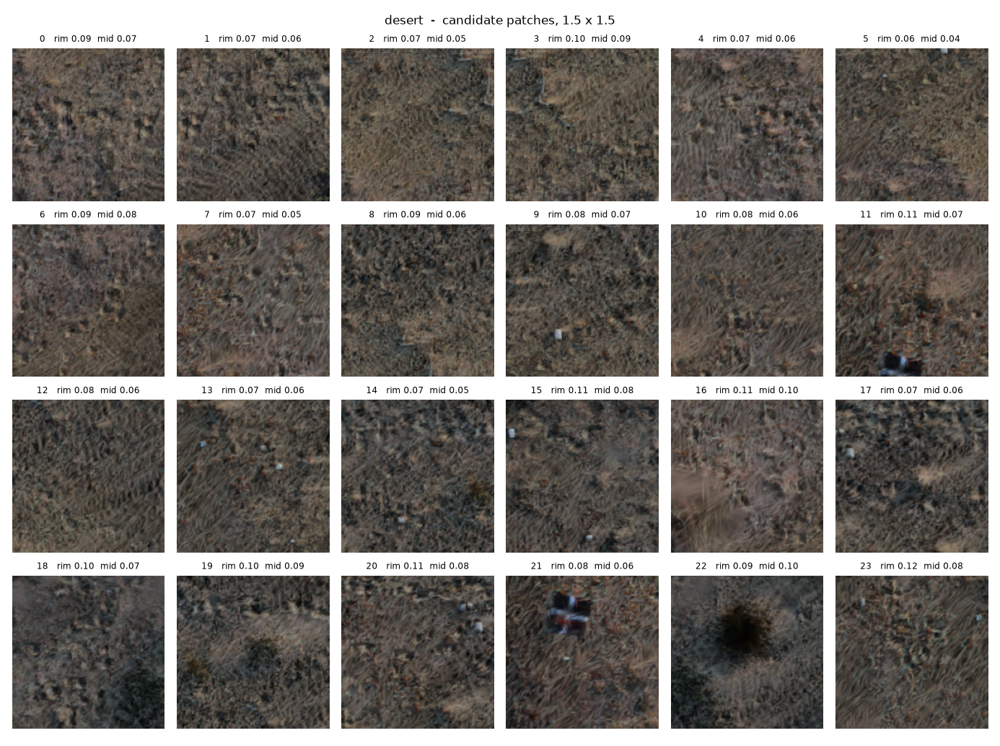

# bozkır

Procedural terrain from captured Gaussian splats.

A capture of a few square metres of ground is cut into square tiles whose
edges match, and those tiles are laid out as Wang tiles into terrain that
does not repeat visibly and has no seams.

A reimplementation of *Gaussian Splatting Wang Tiles* (Zeng, Ma and Sander,
SIGGRAPH Asia 2025), taking the boundary artifacts their paper lists as
unsolved a little further.

| bigsur | desert |
|---|---|
|  |  |

---

## Running it

The renderer needs a static server, since ES modules will not load from
`file://`:

```bash
cd web && python -m http.server 8000
```

Then `http://localhost:8000`. A tileset loads by default; drop a zip on the
page to view another.

The constructor needs `numpy`, `plyfile` and `Pillow`:

```bash
python scripts/preview_patches.py data/raw/scene.ply --save-preset scene
python scripts/export_wang.py data/raw/scene.ply --preset scene --patches 0,2,4,5
```

`preview_patches` searches for candidate tiles and writes a sheet of
thumbnails; you pick four and pass their indices to `export_wang`, which
writes `web/data/scene.splat` and `.json`. `--help` on any script lists the
rest.

Tests:

```bash
python tests/run_all.py
```

---

## What the pipeline does

Align the capture to its ground plane, remove floaters and background, then
search for square regions that are flat enough, dense enough, and similar
enough to be interchangeable. The search loosens whichever filter is
rejecting most and reports what it changed, so a capture that needs
different settings still works; one that cannot work at any setting says so.



`preview_patches.py` writes this sheet. Four patches that look alike tile
into ground; four that do not tile into patchwork, so the choice is made by
eye rather than by score alone.

Wang tiles need edges that pair up, so patches are cut and recombined until
each tile edge carries one of a small set of codes. A min-cut seam
(`bozkir/graphcut.py`) places each join where the two patches already agree
rather than down a straight line.

`bozkir/wang.py` builds the tile set and lays out a grid where every shared
edge carries the same code on both sides.


One of the viewer's debug views paints those codes. A boundary that reads as
a single colour is a boundary whose two tiles match; two colours meeting
would be a layout error.

The renderer is WebGL2: per-tile counting sort in a worker, surface warping
onto a height field, LOD with cross-fade, six debug views, and a scripted
camera sweep used for measurement.

---

## Results

**Ordering tiles by depth is degenerate at axis-aligned views.** The minimum
projected depth over a cell's footprint is identical for every cell in a
row when the view lines up with a grid axis — 81 cells collapse to 9 distinct
keys — so whatever breaks the tie decides the whole row at once, and rotating
through alignment reverses nine cells in one frame. A topological sort over
shared-boundary constraints removes it (`scripts/probe_order.py`):

```
    az    depth key    topological
   0.0         27            0
  22.5          0            8
  89.0         54            0
  90.0         27            0
```

The eight at 22.5° are a boundary plane the camera genuinely crosses, all at
`|n·(eye−edge)| = 0.254`, which is where selective merging takes over.

**One sorted order per tile is not enough** once there is relief: 47% of
adjacent pairs come out wrong at one frame per tile. Sorting along the view
direction expressed in the tile's own frame gives exactly zero error.

**The tile frame must be the true Jacobian**, not a normalised rotation.
Normalising discards a stretch of `sqrt(1+|∇h|²)` and material thins on
slopes by that factor.

**A merged group matches an exact world-space sort** to under one bucket of
the 16-bit counting sort, grid rotation included.

**Boundary gap from surface warping** is proportional to curvature times
span and zero in the continuous limit; halving the frames per tile halves
it across a 16x range.

---

## Screening a capture

Not every capture can become tiles. `scripts/inspect_ply.py` reports the
quantities that decide it:

```
planarity ratio   0.0012   plane-like
anisotropy p50       7.8   p90 35.6
size / spacing      1.75   overlapping
occupied columns   84.5%
```

Of five scenes tried, one passed. The others failed for specific reasons: a
sea stack is not ground, an aerial survey shot around a subject yields one
usable region rather than four, a scan of synthetic geometry has no material
to preserve.

---

## Measuring popping

`bozkir/popping.py` separates what changed because the camera moved from
what changed for another reason: estimate the motion, undo it, and the
residual is what motion cannot explain. Capture a sweep from the viewer,
then:

```bash
python scripts/pop_metric.py frames/topological --against frames/depth
```

This is weaker than the published instrument and the difference matters.
StopThePop uses RAFT for flow and FLIP for the weighting; here the global
translation comes from phase correlation and the local refinement from block
matching, which is integer-accurate at best. On splat terrain a sub-pixel
registration error lights up a fifth of the frame, and that floor is
currently larger than the effect being measured. The numbers compare
orderings on one camera path and are not comparable to published figures.

---

## Limitations

Splats cannot be relit — the lighting is baked at capture, so there is no
time of day and no dynamic lights.

Tiles are surfaces, so there is no underside; looking up from below shows
the far side of the same Gaussians. GSWT names this first among their own
limitations and points at Wang Cubes.

Shadows in the capture become part of the repeating pattern. Captures under
overcast light tile better than captures under hard sun.

The order within a merged group assumes flat tiles: a cell contributes its
patch's depths plus one constant, exact under translation and approximate
once the surface is warped.

---

## Layout

```
bozkir/     the constructor: ply, transform, select, patches, graphcut,
            tile, wang, pack, scene, presets, camera, render, popping
scripts/    thin CLI wrappers; none imports another
web/        the renderer: viewer, sort-worker, grid, order, merge,
            tileset, capture
tests/      run_all.py runs all four suites
```

---

## References

Zeng, Ma, Sander. *Gaussian Splatting Wang Tiles.* SIGGRAPH Asia 2025.

Zeng, Ma, Sander. *Hybrid Gaussian Wang Tiles for Class-aware Authoring and
Rendering.* SIGGRAPH 2026.

Radl, Steiner, Parger, Weinrauch, Kerbl, Steinberger. *StopThePop: Sorted
Gaussian Splatting for View-Consistent Real-time Rendering.* SIGGRAPH 2024.

Kerbl, Kopanas, Leimkühler, Drettakis. *3D Gaussian Splatting for Real-Time
Radiance Field Rendering.* SIGGRAPH 2023.