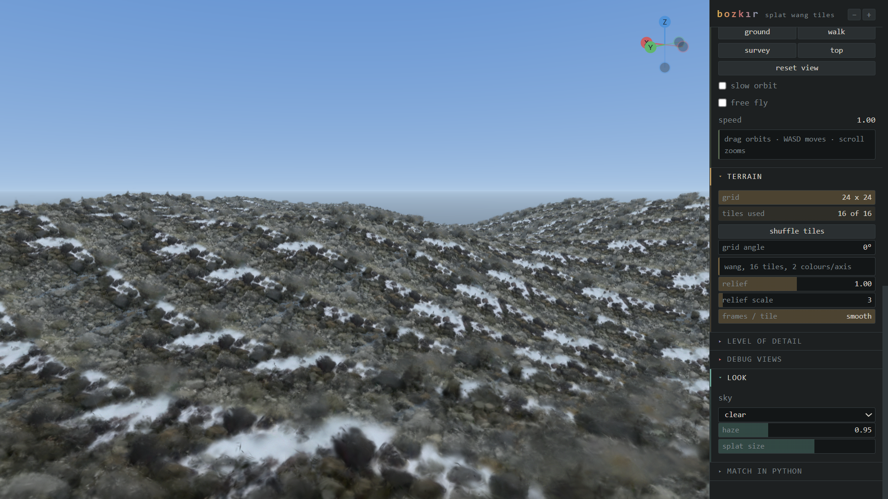
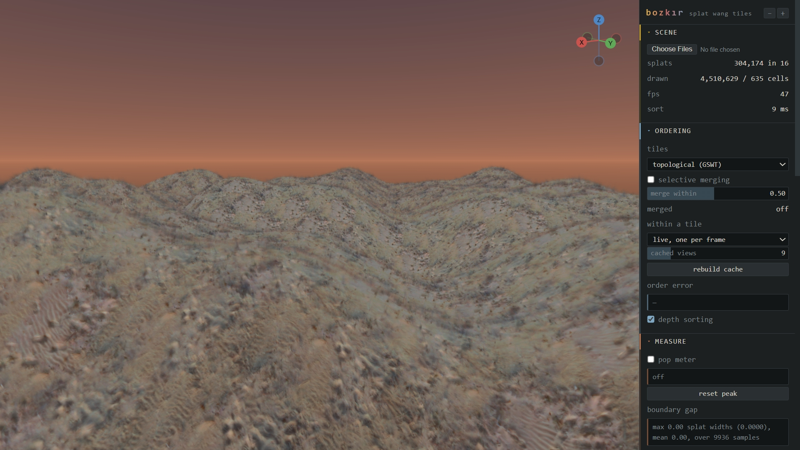
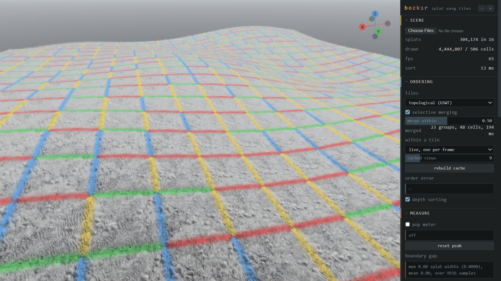

# bozkır

**Photograph a few square metres of ground. Get terrain that runs to the horizon.**

A drone photographs a patch of coastal ground. That capture is reconstructed
as 3D Gaussians, cut into square tiles whose edges match, and laid out as
Wang tiles — so the ground repeats without looking like it repeats, and
without a seam anywhere.

Real material, real parallax between the pebbles, real self-shadowing in the
grass. None of it modelled by anyone.

Two captures, one pipeline:

| coastal cobble | desert scrub |
|:--:|:--:|
|  |  |
| a drone over a bluff | an aerial survey, 38 photographs |

---

## Try it

```bash
cd web && python -m http.server 8000
```

Open `http://localhost:8000`. A scene loads by itself. Drag to orbit, WASD to
move, scroll to zoom.

To view your own capture, drop a tileset zip onto the page.

---

## How it works

**Find four squares that look alike.**


The pipeline searches the capture for flat, dense, uniform squares and shows
what it found. Four that look like each other tile into ground; four that do
not tile into patchwork. You pick.

**Cut them so the edges match.**

Wang tiles need edges that pair up. Patches are recombined so each tile edge
carries one of a small set of codes, and a min-cut seam places the join where
the two patches already agree — down a shadow or a crack, never a straight
line.

**Lay them out.**



Every shared edge carries the same code on both sides. The debug view above
paints those codes: a boundary that reads as one colour is a boundary that
matches.

---

## What is measured

Everything below is a number from a script, not an impression.

**Ordering tiles by depth breaks at axis-aligned views.** When the camera
lines up with the grid, every cell in a row projects to an identical depth —
81 cells collapse to 9 distinct values — so whatever breaks the tie flips the
whole row in one frame. GSWT's topological sort removes it:

```
    az    depth key    topological
   0.0         27            0
  22.5          0            8     <- a boundary the camera really crosses
  90.0         27            0
```

`python scripts/probe_order.py`

**One sorted order per tile is not enough** once there is any relief — 47% of
adjacent pairs come out wrong. Sorting along the view direction expressed in
the tile's own frame gives exactly zero error, which is an answer rather than
an approximation.

**The tile frame must be the true Jacobian**, not a normalised rotation.
Normalising drops a stretch factor and the material thins on slopes by
precisely that amount.

**Merged tiles match an exact sort** to under one quantisation bucket,
checked against splats placed in world space exactly as the shader places
them.

---

## Two halves, joined by a file

```
  capture (.ply)  ──▶  Python constructor  ──▶  tileset (.splat + .json)
                                                        │
                                                        ▼
                                                 browser renderer
```

No server between them. The constructor writes a tileset; the page reads one.
The same arrangement GSWT ships with, and it means the demo works for a
capture the author has never seen.

**Constructor** — align to the ground, clean, search for patches, cut, seam,
build the tile set, pack.

```bash
python scripts/preview_patches.py data/raw/scene.ply --save-preset scene
python scripts/export_wang.py data/raw/scene.ply --preset scene --patches 0,2,4,5
```

The search loosens whichever filter is rejecting and says what it changed, so
a capture needing different settings still works without anyone knowing the
flags. A capture that cannot work at any setting says so.

**Renderer** — WebGL2, per-tile counting sort in a worker, surface warping,
LOD with cross-fade, sky and haze, six debug views, and a scripted camera
sweep for measurement.

---

## Screening a capture

Not every capture can become tiles. `inspect_ply.py` says whether one can,
before you spend an evening finding out:

```
planarity ratio   0.0012   plane-like
anisotropy p50       7.8   p90 35.6
size / spacing      1.75   overlapping
occupied columns   84.5%
```

Of five scenes tried, one passed. The four that failed each failed for a
specific, measurable reason — a sea stack is not ground, an aerial survey is
captured around a subject, a Minecraft scan has no material to preserve.

---

## What it cannot do

**Splats cannot be relit.** The lighting is baked at capture. No time of day,
no dynamic lights. Fine for fixed-lighting work — archviz, previs, simulation
— and a hard limit everywhere else.

**Tiles are surfaces, so there is no underside.** Looking up from below shows
the far side of the same Gaussians.

**Shadows in the capture become part of the pattern.** A capture under hard
sun tiles its own shadows. Shoot under overcast.

---

## Reading

Zeng, Ma, Sander. *Gaussian Splatting Wang Tiles.* SIGGRAPH Asia 2025.
The paper this reimplements, and the source of the ordering and merging.

Zeng, Ma, Sander. *Hybrid Gaussian Wang Tiles for Class-aware Authoring and
Rendering.* SIGGRAPH 2026.

Radl et al. *StopThePop.* SIGGRAPH 2024. Where the popping metric comes from.

Kerbl et al. *3D Gaussian Splatting for Real-Time Radiance Field Rendering.*
SIGGRAPH 2023.

---

## Tests

```bash
python tests/run_all.py
```

Four suites — the Python package, the popping metric, the patch search, and
the browser modules. A missing dependency reports as skipped, not failed.