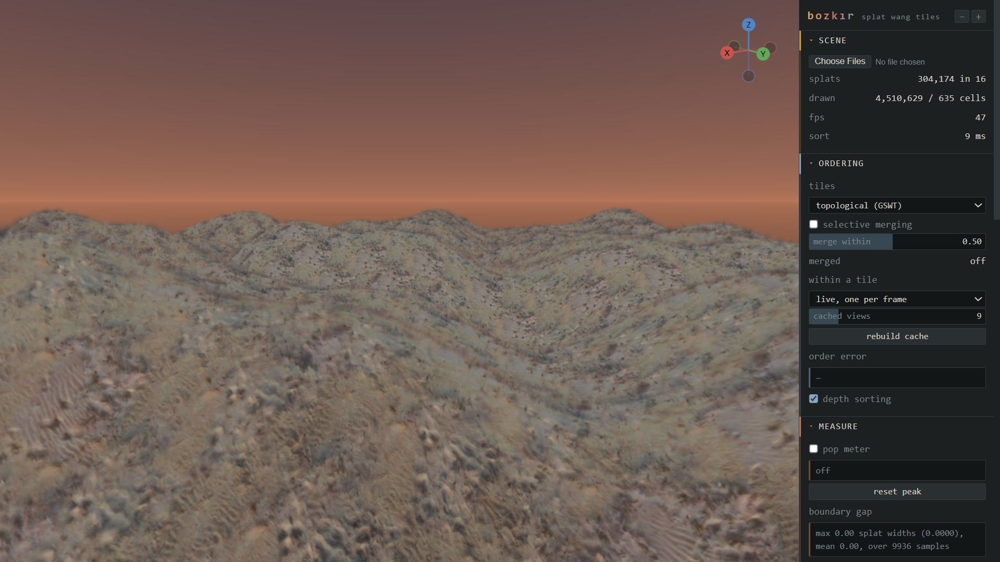
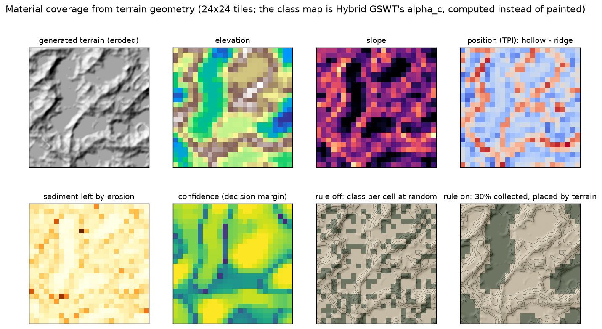
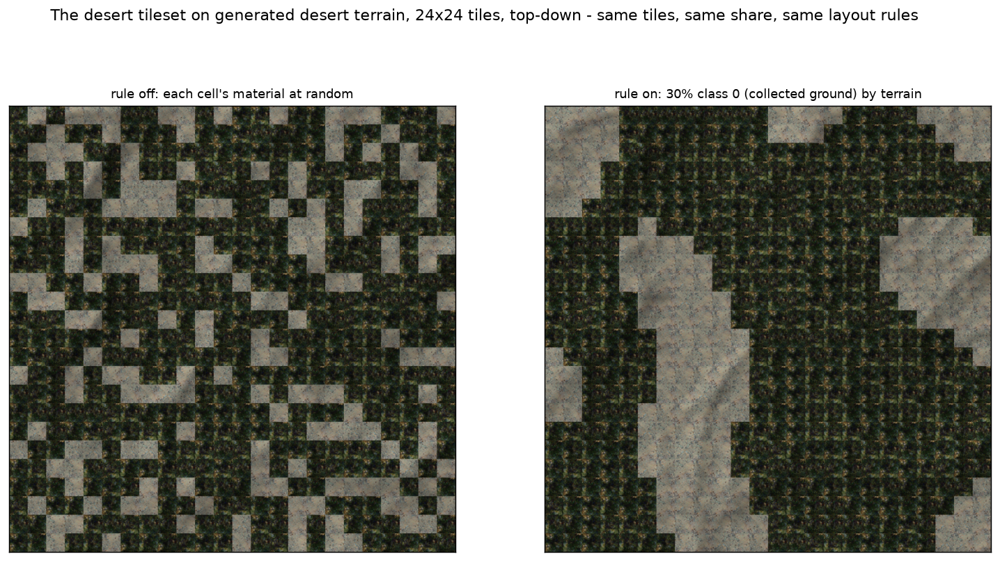
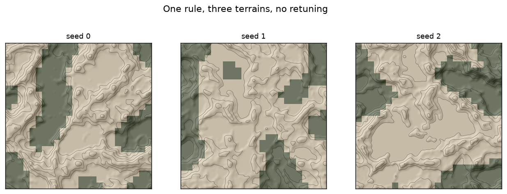
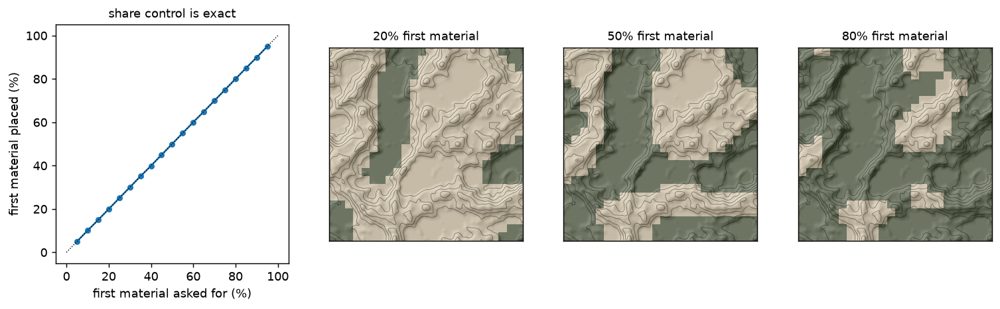
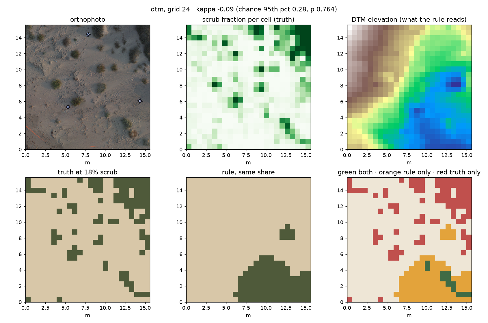
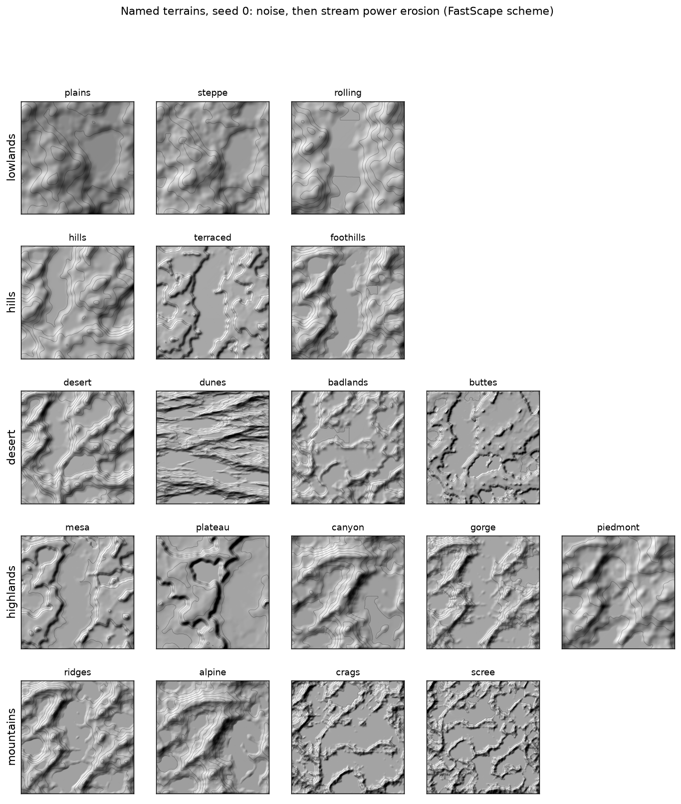
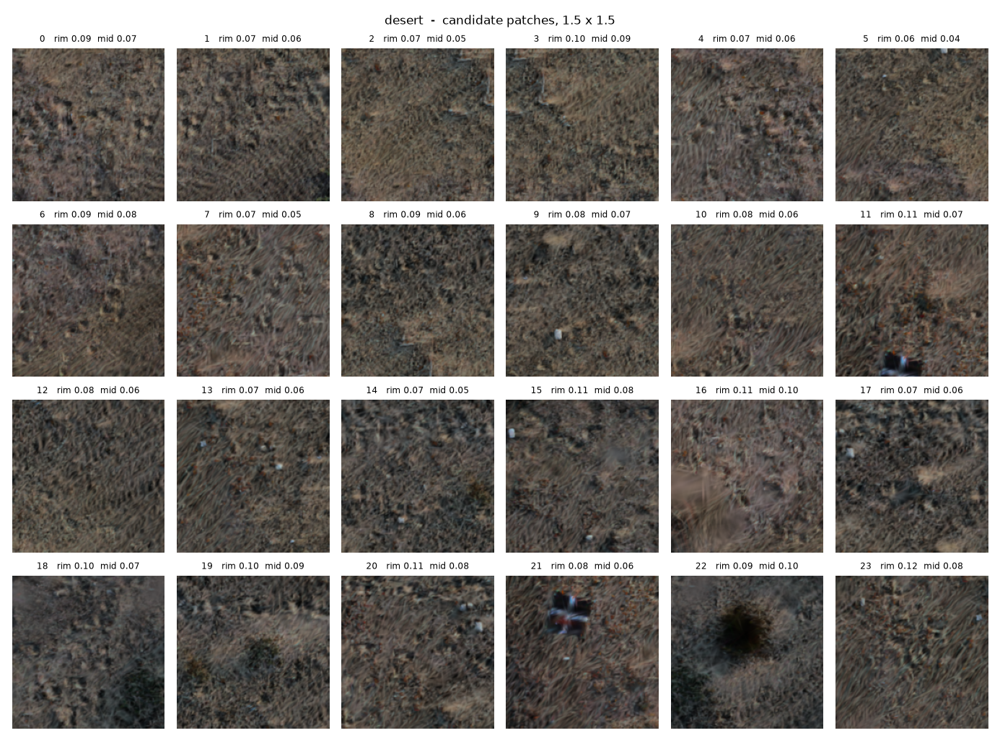
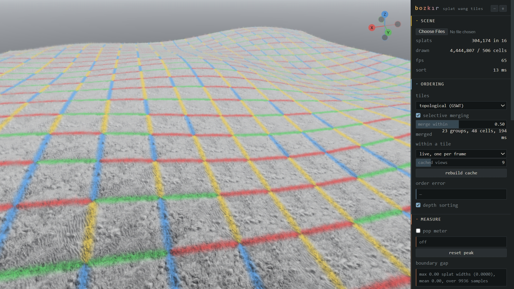
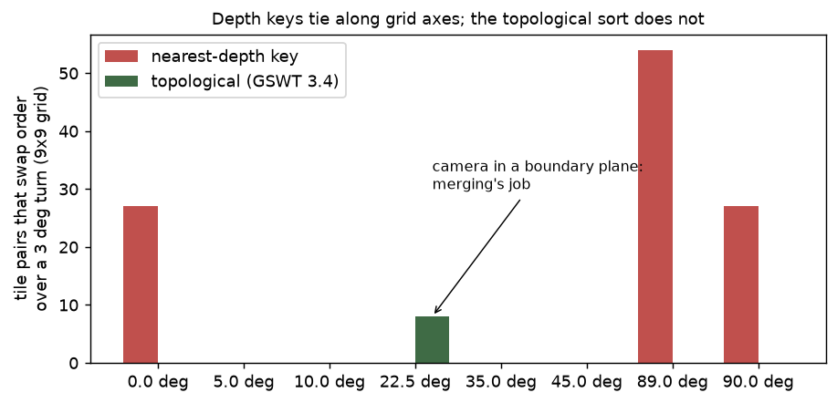

# bozkır

Procedural terrain from captured Gaussian splats, with material placed by
the shape of the ground.

A capture of a few square metres of ground is cut into square tiles whose
edges match and laid out as Wang tiles into terrain with no visible seam.
That part reimplements *Gaussian Splatting Wang Tiles* (Zeng, Ma and Sander,
SIGGRAPH Asia 2025). **What is new is where each material goes.**

**Live demo: [husmen8.github.io/bozkir](https://husmen8.github.io/bozkir/)** -
the desert tileset on its terrain, in the browser (WebGL2).
[`?scene=starter`](https://husmen8.github.io/bozkir/?scene=starter) is a
two-material tileset generated in the page, with no data at all.



**What it is for.** Ground under a fixed light: game levels with a set time
of day, architectural visualisation, previs, and training or simulation
grounds that need real surfaces over large procedural terrain. Capture a
few square metres of real ground; get kilometres of it laid over terrain,
with materials placed where the land says they go.

**What it is not for.** Anything that must be relit or have a day cycle
(lighting is baked into a capture), cliffs and walls, trees and tall
objects as tiles, water, and captures with too little clean flat ground -
roughly four tile-sized areas of each material.

## Install and run

```bash
git clone https://github.com/husmen8/bozkir && cd bozkir
pip install -r requirements.txt          # Python 3.10+
python tests/run_all.py                  # ~300 tests; the web suite needs Node 22+
cd web && python -m http.server 8000     # then open http://localhost:8000
```

The page opens on the desert tileset laid over its terrain. `?scene=starter`
needs no data at all: a two-material tileset generated in the browser, on
generated ground. Everything below - making a tileset from your own capture,
generating terrain, validating the rule - uses the same install.

---

## The contribution: material coverage computed from terrain

*Hybrid Gaussian Wang Tiles* (SIGGRAPH 2026) picks a material class at each
world position with

```
P̃_c(x, u) = P_c(u) ^ (1 / α_c(x)),    c* = argmax_c P̃_c(x, u)
```

where α_c(x) is a target-coverage field per class — and in their authoring
tool **a person paints it**. Nobody paints a ten-kilometre map, and every
terrain shader in every engine already places material by slope and height.

bozkır computes α_c from the terrain instead: slope, topographic position
(TPI, Weiss 2001), drainage, altitude, and on generated terrain the
erosion's own sediment record. Their equation takes it unchanged.



The same decision rendered from the real tiles - every cell the tile the
viewer's layout would put there, seen from above, the terrain as shading -
with only the placement of each class differing between the panels:



The rule's weights live in one file, `web/rule.json`, which the viewer
loads and `bozkir/landform.py` reads - one source, held identical cell
for cell by the tests. The rule reads four maps sampled at 4× the tile grid (one sample per tile
aliases), max-pools drainage so a channel narrower than a tile survives,
passes the class-lead field through a **median filter** (edge-preserving,
so regions become contiguous without the boundary moving) and thresholds it
at a **quantile**, so the requested share is exact by construction.



The same rule with the same settings on three terrains: it is a rule, not a
placement. The share is an artist's control and the terrain decides where
that share goes:



**What this can and cannot claim.** Finding tiles, splitting a capture into
classes, the terrain analysis and the rule work for any input. The mapping
from landform to material — collected material in hollows, bare ground on
ridges — is a judgement: defensible for sand and gravel in arid ground,
wrong for moss on shaded rock. The claim is *a framework for geometry-driven
material placement*, and `scripts/validate_rule.py` tests the judgement
against a real survey (below). Learning the mapping from surveys is the
open question.

---

## Validating the rule on a real survey

`scripts/validate_rule.py` takes an OpenDroneMap DTM and orthophoto, lines
them up on the viewer's cell grid, runs the viewer's own rule on the DTM,
and scores its map against where scrub actually grows:

```bash
python scripts/validate_rule.py odm_dem/dtm.tif odm_orthophoto/odm_orthophoto.tif --dsm odm_dem/dsm.tif
```

Three things keep the number honest. The rule is given the true share, so
it is judged only on *where*. Chance is measured, not assumed: material is
clumped, and clumpy maps overlap by chance, so the truth is shifted around
a torus and scored at every offset. And the hypothesis — in arid ground
scrub grows where water collects — is stated before looking, with the
flipped mapping reported beside it. Truth comes from colour and,
independently, from vegetation height (DSM − DTM), since they fail in
different ways.

**Result: null.** On the one survey available - a 15.6 m desert plot, ODM
DTM and orthophoto - the rule never beats chance, at any grid, against
either truth, and neither does its flipped mapping:

| grid | truth | scrub share | κ rule | κ flipped | chance κ (95th pct.) | p (rule) |
|---|---|---|---|---|---|---|
| 16 | colour | 18% | −0.07 | −0.10 | 0.35 | 0.61 |
| 24 | colour | 18% | −0.09 | −0.09 | 0.28 | 0.76 |
| 32 | colour | 18% | −0.13 | −0.06 | 0.24 | 0.91 |
| 16 | height | 3% | −0.04 | −0.04 | 0.08 | 1.00 |
| 24 | height | 3% | −0.03 | −0.03 | 0.13 | 1.00 |
| 32 | height | 3% | −0.03 | −0.03 | 0.09 | 1.00 |



What is known, and what is only suspected:
- *Facts.* The plot is one slope - a single tilted plane explains 86% of
  its height - with few hollows or ridges for the rule to tell apart. The two truths disagree (18% scrub by colour, 3% by height).
  Across the cue ablation about 42 comparisons were made, so the single
  p = 0.014 among them is what chance produces.
- *Inferences, testable with the data already in hand.* A low sun makes
  shadows read as scrub and inflates the colour truth; ODM's DTM kept some
  bushes as ground, which flattens the height truth.
- *What needs new data.* Scale: a survey spanning several landforms,
  100 m or more, captured overcast.

The script now prints these caveats itself (one plane, disagreeing truths,
the smallest p against the number of comparisons), so the next survey is
read with them from the start. No mapping is fitted to this plot - with one
slope it would learn noise.
The null is the motivation for the open question: learning placement from
surveys that span landforms.

---

## Running it

The renderer needs a static server, since ES modules will not load from
`file://`:

```bash
cd web && python -m http.server 8000
```

Then `http://localhost:8000/?scene=desert`. Drop a tileset zip on the page
to view another.

From a capture of your own ground to a tileset, in one command:

```bash
pip install -r requirements.txt
python scripts/make_tileset.py my_ground.ply
```

It decides whether the capture holds one material or two, uses the
defaults meant for an untuned capture, prints everything the exporter
says, and ends with a verdict - *good*, *marginal* (and why), or *no* (and
why) - and the address to open. The steps below are the same tools with
every control exposed.

The same steps with every control exposed:

```bash
python scripts/preview_patches.py data/raw/scene.ply --save-preset scene
python scripts/export_wang.py data/raw/scene.ply --preset scene --patches 0,2,4,5
python scripts/export_wang.py data/raw/desert.ply --preset desert3
python scripts/bake_atlas.py desert
python scripts/terrain_gen.py --name desert --size 512 --ridge 0.6
python scripts/terrain_gen.py --name canyon --profile canyon --size 512
```

**Terrain is generated in the browser too.** Nineteen profiles in five
groups - lowlands (plains, steppe, rolling), hills (hills, terraced,
foothills), desert (desert, dunes, badlands, buttes), highlands (mesa,
plateau, canyon, gorge, piedmont) and mountains (ridges, alpine, crags,
scree) - and any seed. **terrain…** in the scene section opens a
window with a preview of every profile at the current seed; step the seed
and the previews follow, double-click one to make it. Or from the URL:
`?scene=desert&gen=canyon&seed=3&size=256`. The generator is
stream power erosion solved the FastScape way (Braun and Willett 2013), and
the Python and JavaScript versions are held to the same output bit for bit,
so a profile and a seed name the same ground everywhere. Generated terrains
are kept in the browser's storage; nothing touches the server.
[docs/terrain.md](docs/terrain.md) maps each step to its source and says
where it is simpler than the literature.



The same profiles from Python: `--profile canyon --seed 3`; anything passed
explicitly still wins.

**Tileset and terrain are separate choices.** `?scene=desert&height=mesa`
puts the desert tiles on mesa ground, and the panel's two menus do the same
without editing the URL. They read `web/data/index.json`, which lists what
the folder holds - a static server cannot be asked, so the folder says.
The tools that write there rebuild it; `python scripts/index_data.py` does
it by hand after moving files around.

**class decision** paints each cell with the class the rule chose, washed
towards grey where it was nearly undecided. That is the decision itself
rather than the material drawn, and the two can differ: tiles are sorted
into classes by average appearance, so one can hold material from the
other, and cells in the blend band draw some of their runner-up. Without
the overlay a green-looking summit is unexplainable; with it, either the
rule called it collected or it did not.

**View presets.** `web/views.json` holds named viewer settings - the README's own,
the matched pair for the rule on/off figure, a low vista, height alone.
The preset menu sets each control exactly as a hand on the slider would,
so a preset can only do what the panel can, and `?preset=proof-on` in the
URL makes a figure reproducible from its name. Add your own; a test checks
every preset names real controls with values in range.

Relief scale follows the grid until you move it, flags itself when it is
below the grid (the height field then repeats), and follows again once
dragged back to the grid size.

The panel opens with the controls for using the viewer. **show everything**
adds the ones for measuring it: ordering, measurement, level of detail, the
debug views and the finer terrain controls.

The exporter's defaults are set for a capture nobody has tuned: seams by
graph cut (`--no-cut` for speed), at most 60,000 splats per patch
(`--max-per-tile 0` keeps all), and three warnings that name their fix - a
capture that looks upside down (`--flip`), a `--size` far from the
capture's own scale (with a suggested size), and patches of one material
that overlap, which means that material will repeat.

`preview_patches` searches for candidate tiles and writes a sheet of
thumbnails; pick four and pass them to `export_wang`. `--classes 2` splits
a capture into two materials and refuses if it only holds one.
`terrain_gen` writes an eroded height field and its sediment map;
`heightmap.py` makes one from a drone DTM or from any PLY.

Figures and tests:

```bash
python scripts/figures.py
python tests/run_all.py
```

**Look and figures.** Ground shading darkens what the terrain itself would
darken - a hollow sees less sky than open ground - and never adds light,
since the capture cannot be relit. Exposure and saturation compensate for
`.splat` keeping only the constant colour term. Figure mode (F) hides the
panel, and **save PNG** (P) writes the canvas at full resolution, named
after the scene, grid, rule and camera, so a figure can be retaken exactly.

Viewer settings that look right: relief scale = grid size (the one that
matters), grid 24, relief 1.2, follows height 40%, patch size 3, first
material 30%, decisiveness 3, blend on at 0.25.

---

## The pipeline

Align the capture to its ground plane, remove floaters and background, then
search for square regions flat, dense and similar enough to interchange.
The search loosens whichever filter rejects most and reports what it
changed; a capture that cannot work at any setting says so.



Patches are cut and recombined until each tile edge carries one of a small
set of codes, with a min-cut seam (`bozkir/graphcut.py`) placing each join
where the two patches already agree. For two materials, classes share edge
codes: each code tuple exists once per class, so a cell can take either
class without consulting its neighbours and the matching constraint can
never overrule the terrain.



Height fields come from three sources in one format — a drone DTM, a PLY
rasterised at the 15th percentile per column, or generated fractal terrain
with stream-power erosion — stored at 16 bits across two PNG channels
(browsers decode 16-bit greyscale PNGs to 8 bits).

The renderer is WebGL2: per-tile counting sort in a worker, Wang layout,
surface warping onto the height field, LOD with cross-fade, per-splat
boundary blending between classes, debug views, and a scripted camera sweep
for measurement. Beyond that:

- **Far field.** Past the splat levels of detail the ground is one mesh
  textured from an atlas of every tile seen from above
  (`scripts/bake_atlas.py`), laid out by the same Wang layout and material
  rule - one draw call for all distant cells. Chosen over hierarchical 3DGS
  (Kerbl et al. 2024) because the limit here is draw calls, not splat count.
  It is opaque, its colour is matched per tile to the splats' mean, its
  detail fades to the tile mean with distance, and the hand-over is a
  dithered screen door on both sides.
- **Auto quality.** Holds about 30 fps the way games do: render resolution
  first (50-100%), level-of-detail distance only as a slow second lever
  with settling holds - two levers moving at once chased each other between
  20 and 45 fps.
- **Detail relief.** Ridged integer-hash noise at tile scale, identical in
  the splats, the far field and the camera's ground clamp, masked to steep
  slopes and convex crests (a slope ramp plus a crest term, as terrain
  shaders do), so flat ground stays flat.
- **Relief grows with the world**, so a big grid has hills rather than the
  same bumps spread thin.
- **Starter scene** (`web/starter.js`): a two-material Wang set generated
  in the page, opened when no data loads or with `?scene=starter`.
- The GPU in use is shown in the panel; laptops default to the integrated
  chip, and the page asks for the high-performance one.

---

## Reimplementation results

These reproduce and measure GSWT's own methods; they are not the
contribution, but they are what make the terrain render correctly.

**Ordering tiles by depth is degenerate at axis-aligned views.** The
nearest projected depth ties for every cell in a row when the view lines up
with a grid axis — 81 cells collapse to 9 keys — and rotating through
alignment reverses a whole row in one frame. GSWT's topological sort over
shared-edge constraints removes it (`scripts/probe_order.py`). The 8 at
22.5° are a boundary plane the camera genuinely crosses, which is where
selective merging takes over.



**Selective merging** matches an exact world-space sort to under one bucket
of the 16-bit counting sort. A counting sort over the union beats a k-way
merge: 3.8 vs 9.5 ms at 300k splats, 25.6 vs 76.8 ms at 1.2M.

**On warped terrain, one sorted order per tile is not enough**: 47% of
adjacent pairs come out wrong. Sorting along the view direction in the
tile's own frame gives zero error. That frame must be the true Jacobian —
normalising it thins material on slopes by exactly `sqrt(1+|∇h|²)`.

**Scaling** (GTX 1650 Ti): 60 fps to grid 40 (1,600 tiles, 5.5M splats),
30 fps at 48. Draw calls are the ceiling (906 at grid 48), not splat
count; sort time stays at 10.2 ms because it is per patch, not per cell.
With the far field and auto quality, grid 256 × 256 (about 380 m of
ground) stays above 30 fps.

**Erosion.** Stream power carves where droplet erosion only smoothed:
channel network 11.7% → 33.9% of cells, height–drainage correlation
−0.29 → −0.46, and about 100× faster.

---

## Screening a capture

Not every capture can become tiles. `scripts/inspect_ply.py` reports
planarity, anisotropy, size against spacing and occupied columns, and
`scripts/make_tileset.py` ends with a verdict. Of the captures tried, one
is used: a sea stack is not ground, an aerial survey shot around a subject
yields one usable region rather than four, a synthetic scan has no material
to preserve, and one reconstruction had failed (anisotropy median 484).
The screening table, and what each difficult capture taught, is in
[docs/captures.md](docs/captures.md).

---

## Measuring popping

`bozkir/popping.py` undoes the camera's motion and measures what is left.
It uses phase correlation and block matching where StopThePop uses RAFT and
FLIP, and that matters: block matching is integer-accurate, and on splat
terrain a one-pixel registration error lights up the frame by more than the
ordering effect being measured. **It does not yet resolve the difference**;
the ordering result above does not depend on it.

---

## The usual objections to splats in games

Practitioners' objections to Gaussian splats in games are consistent: no
collision, large files, visible seams where big scenes are split, content
that cannot be edited, no relighting. Where bozkır stands on each:

| objection | bozkır's answer | what remains |
|---|---|---|
| no collision | the ground is a height field, so the collider is the terrain itself - the hybrid "render the splats, collide with a hidden mesh" pattern engine users recommend | the tiles' own micro-relief is not in the collider |
| huge files | a kilometre-scale world from a 21.8 MB tileset (36 tiles) | the source capture is still large |
| seams when splitting big scenes | Wang tiles are seamless by construction; the far field hands over by dithering | a faint colour step at the hand-over (viewing angle) |
| cannot be edited | layout, materials and terrain are procedural: rules, presets and sliders | the captured micro-geometry itself is not editable |
| no relighting | not solved: lighting is baked, and ground shading only darkens | a sunny capture repeats its shadows |

Against generative world models (text-to-world, diffusion terrain) bozkır
does not compete on variety. It is *capture-driven procedural*: real
captured appearance, deterministic (a seed regenerates the same world bit
for bit), controllable by rule, and cheap - it runs in a browser on a
laptop GPU with no training.

---

## Limitations

Splats cannot be relit: lighting is baked at capture, so there is no time
of day and no dynamic light. Suited to fixed-lighting work — archviz,
previs, simulation, games with a set time of day.

Tiles are surfaces with no underside. Shadows in the capture become part of
the repeating pattern; overcast captures tile better than sunny ones.

**Repetition, and what is done about it.** Each tile is four triangles, one
per edge, and each triangle is always the same part of the patch assigned
to that edge's colour - the construction of Cohen et al. (SIGGRAPH 2003).
With two colours, half the grid shows the same south triangle in the same
place, and anything distinctive in it becomes a lattice. Two things fight
that. `export_wang.py --colours 3` gives each triangle three possible
patches instead of two, and builds Cohen et al.'s minimal set - two tiles
per (west, south) pair, 18 per class rather than the 81 of every
combination - since two choices at each step is already enough never to
repeat. And the patch search now scores down *landmarks*: a pale spot in
scrub, a stone, a survey marker. Texture is not noticed repeating; a
landmark is, so a patch carrying one ranks far lower, and
`preview_patches.py` labels it in red. Corner tiles (Lagae and Dutré 2006;
also Cohen et al. §3.4) remain the fix for features crossing a corner.

Two more tools came from looking at the result. **Rotations**
(`--rotations 3`): a patch turned by 90° before tiles are built is just
another patch, so it can be another edge colour - turning a *finished*
tile would break Wang matching, turning a patch does not (its baked
shadows turn too). **Purity** (on by default): each class keeps the patches
with the least ground that looks like the other class, which removed pale
sand openings from scrub tiles.

`scripts/repetition.py` measures repetition as the excess similarity at
whole-tile shifts over half-tile shifts, on brightness ("texture") and on a
landmark map. On the desert tileset (lower is less repetition):

| setting | sand texture | scrub texture | sand landmarks | scrub landmarks | owner's eye |
|---|---|---|---|---|---|
| 2 colours, straight seams | 0.502 | 0.413 | 0.479 | 0.381 | - |
| 3 colours, straight | 0.335 | 0.396 | 0.304 | 0.244 | - |
| 3 colours, graph cut | 0.317 | 0.380 | - | - | - |
| 3 colours, 2 sources × 3 turns (`desert3`) | 0.314 | 0.353 | 0.280 | 0.307 | **best** |
| 3 colours, 3 sources × 2 turns | 0.334 | 0.276 | 0.284 | 0.259 | worst |
| 4 colours, 4 sources × 2 turns (`desert2`) | 0.270 | 0.225 | 0.211 | 0.180 | second |

More colours cut sand repetition by a third, and graph cut matters more to
the eye (a visible X) than to the metric. **Neither repetition metric
agrees with the eye**: the run the owner judged best is not the one that
repeats least. The eye traded repetition against *busyness* - how
different a tile's four triangles are from each other - and preferred calm
ground.

Busyness is measurable: the share of a tile's brightness variance
explained by which of its four triangles a pixel is in (0 = one ground,
1 = four flat blocks). On the two runs that still exist:

| setting | sand busyness | scrub busyness | owner's eye |
|---|---|---|---|
| `desert3` | 0.083 ± 0.050 | 0.092 ± 0.044 | best |
| `desert2` | 0.070 ± 0.060 | **0.336 ± 0.136** | second |

`desert2` repeats least but its scrub tiles are 3.6 times busier, which is
what the eye objected to. Two runs agree with the eye; two runs are not a
proof. Perceived quality of tiled ground looks at least two-dimensional,
and a small perceptual study is the proper test.

Class choice is per cell, so without blending the boundary reads as
rectangles; Hybrid GSWT's per-Gaussian priority is why theirs look organic.

`.splat` stores degree-0 colour only, so view-dependent colour is lost on
export (mean error 14 on 0–255).

The far field cannot follow splat size, loses per-splat blending between
classes, and a top-down atlas differs from grazing views: a faint colour
step remains at the hand-over. The desert's scrub is only about 4 × 5 m of
capture, so its patches overlap. Closed basins become flat floors
([docs/terrain.md](docs/terrain.md)). The upside-down check is one-way: a
warning means something, silence proves nothing. Sorting and draw-call
issue stay on the CPU. And the rule's validation is null on the only
survey there is (above).

---

## Layout

```
bozkir/    ply, transform, select, patches, graphcut, tile, wang, pack
           (+ tile atlas), scene, presets, camera, render, popping
           terrain, erosion      height fields, landform maps, generation
           landform              the viewer's rule, read from web/rule.json
           catalogue             what web/data holds, for the viewer's menus
           validate              scoring the rule against a survey
scripts/   thin CLI wrappers; none imports another. make_tileset (one
           command), export_wang, bake_atlas (far field), repetition,
           terrain_gen, heightmap, validate_rule, figures, ...
web/       viewer, sort-worker, grid, order, merge, tileset, capture,
           heightfield (+ openness, detail mask, generated-terrain cache),
           landform + rule.json, terrain + terrain-worker (the generator),
           starter (the no-data scene), benchmark, views.json (presets)
tests/     run_all.py runs the three suites: test_all.py (package),
           test_pipeline.py (pipeline, including both scripts end to end),
           test_web.mjs (browser modules); bridge.mjs runs the shared
           JavaScript for the Python-side parity tests
```

---

## References

Zeng, Ma, Sander. *Gaussian Splatting Wang Tiles.* SIGGRAPH Asia 2025.

Zeng, Ma, Sander. *Hybrid Gaussian Wang Tiles for Class-aware Authoring and
Rendering.* SIGGRAPH 2026.

Radl, Steiner, Parger, Weinrauch, Kerbl, Steinberger. *StopThePop: Sorted
Gaussian Splatting for View-Consistent Real-time Rendering.* SIGGRAPH 2024.

Kerbl, Kopanas, Leimkühler, Drettakis. *3D Gaussian Splatting for Real-Time
Radiance Field Rendering.* SIGGRAPH 2023.

Weiss. *Topographic Position and Landforms Analysis.* ESRI User Conference,
2001.

Braun, Willett. *A very efficient O(n), implicit and parallel method to
solve the stream power equation governing fluvial incision and landscape
evolution.* Geomorphology 2013.

Cordonnier et al. *Large Scale Terrain Generation from Tectonic Uplift and
Fluvial Erosion.* Computer Graphics Forum (Eurographics) 2016.

Schott, Paris, Fournier, Guérin, Galin. *Large-scale Terrain Authoring
through Interactive Erosion Simulation.* ACM TOG 2023.

Barnes, Lehman, Mulla. *Priority-Flood: An optimal depression-filling and
watershed-labeling algorithm for digital elevation models.* Computers &
Geosciences 2014.

Lagae, Dutré. *An Alternative for Wang Tiles: Colored Edges versus Colored
Corners.* ACM TOG 2006.